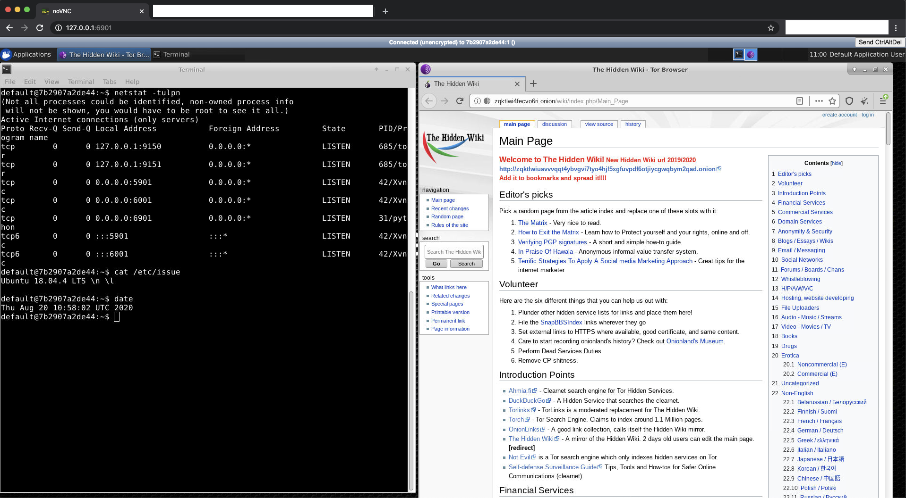

## Usage

Build:

`docker build . -t tor`

Run:

`docker run --rm -p 5901:5901 -p 6901:6901 tor`

Go to `http://127.0.0.1:6901` in your browser and use the password `vncpassword` to authenticate.

Open the Tor browser.

## Shoutout 

https://github.com/ConSol/docker-headless-vnc-container 

## Debug

Get new gpg keys

`gpg --homedir "$HOME/.local/share/torbrowser/gnupg_homedir/" --refresh-keys --keyserver pgp.mit.edu keyserver.ubuntu.com pool.sks-keyservers.net`